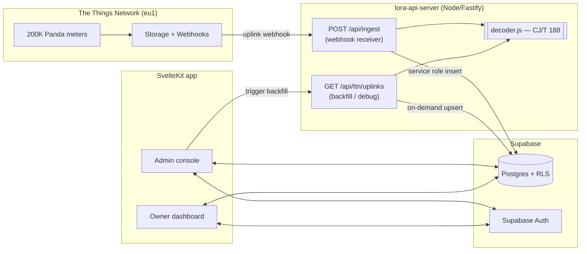

# Water Metering Platform — System Design

A SvelteKit + Supabase platform for managing Panda Ultrasonic water meters at scale
(**200,000+ households**), built on top of the TTN decoding API in
[`app.js`](app.js) / [`decoder.js`](decoder.js).

## 1. Goals & roles

| Role | Capabilities |
|---|---|
| **Admin** | Manage users, households, and devices (meters). Assign one meter to one house. View all readings, device health, and ingestion status. Trigger historical backfills. |
| **House owner** | Sign in and monitor readings for the meter(s) assigned to their household(s): current cumulative usage, daily/monthly consumption, meter health (battery/signal), and alerts. |

Core rules:

1. **One house ⇄ one meter** — enforced by a `UNIQUE` constraint on `devices.household_id`.
2. **Owners only see their own data** — enforced by Postgres **Row Level Security (RLS)**, not application code.
3. **Readings are persisted**, not fetched live from TTN — TTN Storage retention is short
   (~days), so it cannot be the source of truth for 200K meters. Supabase is the system of record.

### Assumptions (adjust as needed)

- Meters report roughly **hourly to a few times per day**. At 200K meters × 24/day ≈ **4.8M rows/day**
  (~1.75B/year) — this drives the partitioning and rollup design in §5.
- Auth is **Supabase Auth** (email/password or magic link). Owners are invited by admins.
- The existing `lora-api-server` stays as the **TTN decode/backfill service**; a small **ingestion
  endpoint** (webhook receiver) is added for live data.

## 2. Architecture



**Two data paths into Supabase:**

- **Live (primary):** TTN *Uplink message* webhook → `POST /api/ingest` → `decoder.js` →
  insert into `readings` using the Supabase **service-role** key (bypasses RLS).
- **Backfill (secondary):** Admin action → `GET /api/ttn/uplinks?last=…&deviceId=…` (already returns
  `decoded`) → upsert into `readings`. Used for gap-filling and onboarding new meters.

**Read path:** SvelteKit talks only to Supabase. RLS guarantees owners see only their rows; admins
see everything. Dashboards query pre-aggregated rollup tables (§5) for speed.

## 3. Data model

```mermaid
erDiagram
  profiles ||--o{ households : owns
  households ||--|| devices : "has one"
  devices ||--o{ readings : produces
  devices ||--o{ daily_consumption : "rolls up to"

  profiles {
    uuid id PK "= auth.users.id"
    text full_name
    text role "admin | owner"
    text phone
  }
  households {
    uuid id PK
    text name
    text address
    text account_number
    uuid owner_id FK
  }
  devices {
    uuid id PK
    text ttn_device_id UK
    text dev_eui UK
    text serial
    uuid household_id FK UK
    text status
  }
  readings {
    bigint id PK
    uuid device_id FK
    timestamptz reading_time
    numeric cumulative_flow
    int f_cnt
    bool checksum_ok
  }
```

### 3.1 Schema (SQL)

```sql
-- Profiles mirror auth.users and carry the role.
create table public.profiles (
  id         uuid primary key references auth.users (id) on delete cascade,
  full_name  text,
  phone      text,
  role       text not null default 'owner' check (role in ('admin', 'owner')),
  created_at timestamptz not null default now()
);

create table public.households (
  id             uuid primary key default gen_random_uuid(),
  name           text,
  address        text,
  account_number text unique,          -- billing / municipal reference
  owner_id       uuid references public.profiles (id) on delete set null,
  created_at     timestamptz not null default now()
);
create index on public.households (owner_id);

-- Devices = physical meters. One meter per household (UNIQUE household_id).
create table public.devices (
  id             uuid primary key default gen_random_uuid(),
  ttn_device_id  text not null unique,   -- e.g. lye-yellow-device-5000240
  dev_eui        text unique,
  serial         text,                   -- decoded CJ/T 188 serial, e.g. 25033150000240
  application_id text default 'lye-application-01',
  household_id   uuid unique references public.households (id) on delete set null,
  status         text not null default 'active' check (status in ('active','inactive','faulty')),
  installed_at   timestamptz,
  created_at     timestamptz not null default now()
);
create index on public.devices (household_id);

-- Readings = decoded uplinks. Partitioned by month for volume (see §5).
create table public.readings (
  id               bigint generated always as identity,
  device_id        uuid not null references public.devices (id) on delete cascade,
  reading_time     timestamptz not null,          -- meter_time (fallback: received_at)
  received_at      timestamptz not null,
  f_cnt            int,
  cumulative_flow  numeric,                        -- from decoded.cumulative_flow.value
  reverse_flow     numeric,
  instant_flow     numeric,
  status           int,
  checksum_ok      boolean,
  rssi             int,
  snr              numeric,
  raw              jsonb,                           -- full decoded object for audit
  primary key (id, reading_time)
) partition by range (reading_time);

-- Idempotency: one row per (device, frame counter). Prevents duplicate webhook inserts.
create unique index readings_device_fcnt_uidx
  on public.readings (device_id, f_cnt, reading_time);
create index readings_device_time_idx
  on public.readings (device_id, reading_time desc);
```

### 3.2 Row Level Security

```sql
-- Helper: is the current user an admin? SECURITY DEFINER avoids RLS recursion.
create or replace function public.is_admin()
returns boolean language sql security definer stable
set search_path = public as $$
  select exists (select 1 from public.profiles where id = auth.uid() and role = 'admin');
$$;

alter table public.profiles   enable row level security;
alter table public.households enable row level security;
alter table public.devices    enable row level security;
alter table public.readings   enable row level security;

-- Profiles: users read/update their own; admins do anything.
create policy profiles_self  on public.profiles for select using (id = auth.uid() or public.is_admin());
create policy profiles_admin on public.profiles for all    using (public.is_admin()) with check (public.is_admin());

-- Households: owner sees theirs; admin sees all; only admin writes.
create policy hh_read  on public.households for select
  using (public.is_admin() or owner_id = auth.uid());
create policy hh_write on public.households for all
  using (public.is_admin()) with check (public.is_admin());

-- Devices: visible via household ownership; only admin writes.
create policy dev_read  on public.devices for select using (
  public.is_admin() or exists (
    select 1 from public.households h
    where h.id = devices.household_id and h.owner_id = auth.uid()
  )
);
create policy dev_write on public.devices for all
  using (public.is_admin()) with check (public.is_admin());

-- Readings: owner sees readings for meters in their households; admin sees all.
-- Inserts happen server-side with the service-role key, which bypasses RLS.
create policy rd_read on public.readings for select using (
  public.is_admin() or exists (
    select 1 from public.devices d
    join public.households h on h.id = d.household_id
    where d.id = readings.device_id and h.owner_id = auth.uid()
  )
);
```

> **Note:** the ingestion endpoint uses the **service-role** key and therefore bypasses RLS to insert
> readings. Never expose the service-role key to the browser — it lives only in `lora-api-server`
> (or a Supabase Edge Function).

## 4. Ingestion

### 4.1 Live webhook (primary)

Add one route to `lora-api-server` (reuses `decoder.js`):

```
POST /api/ingest
Header: X-Webhook-Token: <shared secret>   # validates the caller is TTN
Body:   TTN uplink event JSON
```

Handler steps:

1. Verify `X-Webhook-Token` against `WEBHOOK_TOKEN` env.
2. Decode `uplink_message.frm_payload` with `decodeBase64()`.
3. Look up `devices.id` by `ttn_device_id` (cache in memory; unknown devices → log + skip or auto-register as `inactive`).
4. `upsert` into `readings` on `(device_id, f_cnt, reading_time)` using the service-role client.
5. Return `200` quickly (TTN retries on non-2xx).

Configure in TTN: **Integrations → Webhooks → Custom**, enable only *Uplink message*, add the
`X-Webhook-Token` header.

### 4.2 Backfill (secondary)

Admins call the existing decode endpoint and upsert the result:

```
GET /api/ttn/uplinks?last=720h&deviceId=lye-yellow-device-5000240
```

Each returned uplink already carries a `decoded` object — map it to a `readings` row and upsert.
Use this for onboarding a meter's history or filling gaps after downtime. (TTN retention is limited,
so this only reaches back a few days/weeks.)

## 5. Scaling to 200K meters

| Concern | Approach |
|---|---|
| **Table volume** (~1.75B rows/yr) | `readings` is **range-partitioned by month** (`reading_time`). Create partitions ahead of time with `pg_partman` or a scheduled function; drop/detach cold partitions per retention policy. |
| **Dashboard speed** | Never chart raw rows. Maintain a **`daily_consumption` rollup** (device × day: start/end cumulative, delta = usage). Refresh via a Supabase **cron job** (pg_cron) or incrementally on insert. |
| **Cumulative → usage** | `cumulative_flow` is monotonic; **daily/monthly usage = difference** between period-boundary readings. Compute in the rollup, not on read. |
| **Hot query** | `readings_device_time_idx (device_id, reading_time desc)` serves "latest reading" and per-meter history efficiently. |
| **Ingestion throughput** | Webhook does a single indexed upsert; batch when backfilling. Consider a queue (e.g. Supabase Edge Function + `pgmq`) if peak uplink bursts exceed direct-insert capacity. |
| **Duplicate uplinks** | Idempotent upsert on `(device_id, f_cnt, reading_time)`. |

Rollup sketch:

```sql
create table public.daily_consumption (
  device_id       uuid not null references public.devices (id) on delete cascade,
  day             date not null,
  start_cumulative numeric,
  end_cumulative   numeric,
  consumption      numeric generated always as (end_cumulative - start_cumulative) stored,
  reading_count    int,
  primary key (device_id, day)
);
-- Refreshed nightly by a pg_cron job from readings; owners' charts read from here.
```

## 6. SvelteKit application

### 6.1 Project layout

```
src/
├─ hooks.server.ts            # create per-request Supabase client, load session
├─ app.d.ts                   # App.Locals: { supabase, session, profile }
├─ lib/
│  ├─ supabaseClient.ts       # browser client (anon key)
│  ├─ server/
│  │  ├─ supabaseAdmin.ts     # service-role client (server only) — backfill/admin ops
│  │  └─ ttn.ts               # wraps lora-api-server endpoints
│  ├─ components/             # charts, tables, meter cards
│  └─ types/db.ts             # generated Supabase types
└─ routes/
   ├─ +layout.server.ts       # inject session + profile
   ├─ +layout.svelte
   ├─ login/+page.svelte
   ├─ (owner)/                # role: owner
   │  ├─ dashboard/+page.server.ts    # owner's meters + latest readings
   │  └─ meters/[id]/+page.server.ts  # history, daily/monthly charts
   └─ (admin)/                # role: admin (guarded in +layout.server.ts)
      └─ admin/
         ├─ users/           # invite/list/set-role
         ├─ households/      # CRUD, assign owner
         ├─ devices/         # CRUD, assign meter → household, health
         ├─ readings/        # cross-device browse, backfill trigger
         └─ ingestion/       # webhook status, unknown devices
```

### 6.2 Auth & guarding

- `hooks.server.ts` uses `@supabase/ssr` to attach a session-aware client to `event.locals`.
- `+layout.server.ts` loads the `profile` (with `role`) and redirects unauthenticated users to `/login`.
- The `(admin)` group's `+layout.server.ts` throws `error(403)` unless `profile.role === 'admin'`.
- All data reads go through the **RLS-protected anon client** — even if a route forgets a check, the
  database refuses cross-tenant rows. Defense in depth.

### 6.3 Key screens

**Owner dashboard**
- Card per meter: latest cumulative reading, today's usage, battery/signal, last-seen, checksum status.
- Meter detail: line chart of daily consumption (from `daily_consumption`), month-to-date total,
  raw reading table (paginated), health/alerts.

**Admin console**
- Users: invite by email, assign role, deactivate.
- Households: create/edit, set owner, search by `account_number`/address.
- Devices: register meter (`ttn_device_id`, `dev_eui`), assign to a household (blocked if the house
  already has one — the `UNIQUE` constraint), mark faulty, view live status.
- Readings/ingestion: unknown/unassigned devices, last-seen gaps, trigger a backfill window.

## 7. Environments & config

`lora-api-server` (ingestion side) — extend `.env`:

```
TTN_STORAGE_URL=...            # existing
TTN_API_KEY=...                # existing
WEBHOOK_TOKEN=<shared secret>  # validates TTN webhook calls
SUPABASE_URL=...
SUPABASE_SERVICE_ROLE_KEY=...  # server-only; NEVER shipped to the browser
```

SvelteKit — `.env`:

```
PUBLIC_SUPABASE_URL=...
PUBLIC_SUPABASE_ANON_KEY=...
SUPABASE_SERVICE_ROLE_KEY=...  # only if the app performs admin/backfill server actions
```

## 8. Security checklist

- Service-role key only server-side (ingestion / admin actions). Anon key + RLS for all reads.
- RLS enabled on **every** table; owners isolated by `owner_id = auth.uid()`.
- Webhook authenticated via `X-Webhook-Token`; reject on mismatch.
- Admin routes guarded server-side **and** by RLS role checks.
- No PII in URLs; account numbers are opaque references.
- Rotate the TTN API key and `WEBHOOK_TOKEN` on a schedule.

## 9. Roadmap

1. **Schema + RLS** — create tables, policies, `is_admin()`; generate TS types.
2. **Ingestion** — add `POST /api/ingest` to `lora-api-server`; wire TTN webhook; verify rows land.
3. **Backfill** — admin action calling `/api/ttn/uplinks` → upsert; onboard existing meters.
4. **Rollups** — `daily_consumption` + pg_cron nightly refresh.
5. **SvelteKit auth shell** — login, session, role guarding.
6. **Owner dashboard** — meter cards + consumption charts from rollups.
7. **Admin console** — users, households, device assignment (one-house-one-meter), ingestion health.
8. **Partitioning & retention** — pg_partman monthly partitions; alerting on stale meters.
9. **Scale hardening** — load-test ingestion, add a queue if needed, index review.

## 10. Reference — decoded reading shape

The ingestion/backfill code maps each `decoded` object (from `decoder.js`) to a `readings` row:

```json
{
  "meter_type": "cold_water",
  "serial": "25033150000240",
  "seq": 215,
  "cumulative_flow": { "value": 0, "unit": "m3", "unit_byte": 43 },
  "reverse_flow":    { "value": 0, "unit": "L",  "unit_byte": 44 },
  "instant_flow":    { "value": 0, "unit": "flow_rate", "unit_byte": 53 },
  "meter_time": "2026-07-14T09:10:41",
  "status": 512,
  "checksum_ok": true
}
```

> Open item carried over from [`panda-decoder.md`](panda-decoder.md): register **decimal scaling** is
> unconfirmed (all sample readings were `0` on newly-installed meters). Pin down the m³ factor against
> a meter's LCD before trusting absolute consumption; it's a one-line change in `decoder.js`.
```
